# 🐝 Hivemind Agent Swarm

An AI agent orchestration system for Cursor IDE. Deploy, monitor, and coordinate multiple AI agents working in parallel on your codebase.


## Demo

https://github.com/user-attachments/assets/demo.mp4

## Features

- **Multi-Agent Orchestration** - Deploy specialized agents (FORGE, SENTINEL, ORACLE, NEXUS, SCRIBE) with distinct roles
- **CONDUCTOR AI** - An AI orchestrator that manages the swarm and coordinates tasks
- **Real-time Dashboard** - Visual monitoring of agent activity, costs, and status
- **MCP Integration** - Native Model Context Protocol support for Cursor
- **Tiered Model Strategy** - Assign different LLMs to different roles for cost optimization
- **Git Worktree Isolation** - Squad mode for parallel, conflict-free overnight runs

## Architecture

```mermaid
flowchart TB
    subgraph CURSOR["🖥️ CURSOR IDE"]
        direction TB
        CONDUCTOR["🎯 CONDUCTOR<br/><i>AI Orchestrator</i>"]
        
        CONDUCTOR --> FORGE["🔨 FORGE<br/><i>Builder</i>"]
        CONDUCTOR --> SENTINEL["🛡️ SENTINEL<br/><i>Tester</i>"]
        CONDUCTOR --> ORACLE["🔮 ORACLE<br/><i>Research</i>"]
        CONDUCTOR --> NEXUS["🔗 NEXUS<br/><i>Integration</i>"]
        CONDUCTOR --> SCRIBE["📝 SCRIBE<br/><i>Documentation</i>"]
    end
    
    FORGE & SENTINEL & ORACLE & NEXUS & SCRIBE --> TMUX["📺 tmux sessions"]
    TMUX --> CODE["📁 Your Codebase"]
    
    style CONDUCTOR fill:#ff6b6b,stroke:#333,stroke-width:2px,color:#fff
    style FORGE fill:#4ecdc4,stroke:#333,stroke-width:2px,color:#fff
    style SENTINEL fill:#45b7d1,stroke:#333,stroke-width:2px,color:#fff
    style ORACLE fill:#96ceb4,stroke:#333,stroke-width:2px,color:#fff
    style NEXUS fill:#ffeaa7,stroke:#333,stroke-width:2px,color:#333
    style SCRIBE fill:#dfe6e9,stroke:#333,stroke-width:2px,color:#333
    style CURSOR fill:#2d3436,stroke:#636e72,stroke-width:3px,color:#fff
    style TMUX fill:#6c5ce7,stroke:#333,stroke-width:2px,color:#fff
    style CODE fill:#fdcb6e,stroke:#333,stroke-width:2px,color:#333
```



## Quick Start

### Prerequisites

- Python 3.10+
- Node.js 18+
- tmux
- Aider (`pip install aider-chat`)
- An LLM API key (OpenRouter recommended)

### Windows Users (WSL2 Required)

Hivemind uses tmux for agent session management, which requires a Linux environment. On Windows, use WSL2:

```powershell
# 1. Install WSL2 (run in PowerShell as Administrator)
wsl --install

# 2. Restart your computer, then open Ubuntu from Start Menu

# 3. Inside WSL2, install dependencies
sudo apt update
sudo apt install -y tmux nodejs npm python3-pip

# 4. Install aider
pip install aider-chat

# 5. Continue with Installation steps below (inside WSL2)
```

> **Tip:** You can access WSL2 files from Windows at `\\wsl$\Ubuntu\home\yourusername\`
> 
> **Tip:** Run `code .` inside WSL2 to open VS Code/Cursor with WSL integration

### Installation

```bash
# Clone the repo
git clone https://github.com/yourusername/hivemind-agentswarm.git
cd hivemind-agentswarm

# Install MCP server dependencies
cd mcp
pip install -r requirements.txt

# Install dashboard dependencies
cd ../dashboard
npm install
```

### Configuration

1. **Dashboard settings:**
   ```bash
   cp dashboard/settings.example.json dashboard/settings.json
   # Edit settings.json with your API keys and paths
   ```

2. **Cursor MCP integration:**
   Add to your Cursor settings (`~/.cursor/mcp.json`):
   ```json
   {
     "mcpServers": {
       "hivemind": {
         "command": "python",
         "args": ["/path/to/hivemind/mcp/hivemind_mcp.py"],
         "env": {
           "HIVEMIND_PROJECT_DIR": "/path/to/your/project"
         }
       }
     }
   }
   ```

### Running

```bash
# Terminal 1: Start the MCP server (if using HTTP mode)
cd mcp
python hivemind_mcp.py --http --port 8000

# Terminal 2: Start the dashboard
cd dashboard
npm run dev
```

Open http://localhost:5173 to view the dashboard.

## Agent Roles

| Role | Icon | Purpose | Default Model |
|------|------|---------|---------------|
| **FORGE** | 🔨 | Building, creating, implementing | Claude Sonnet 4 |
| **SENTINEL** | 🛡️ | Testing, validation, verification | Claude Sonnet 4 |
| **ORACLE** | 🔮 | Research, analysis, exploration | Configurable |
| **NEXUS** | 🔗 | Integration, coordination, APIs | Configurable |
| **SCRIBE** | 📝 | Documentation, writing | Configurable |
| **CONDUCTOR** | 🎯 | Orchestration, task breakdown | Claude Sonnet 4 |

## Model Profiles

The dashboard supports quick-switching between model profiles:

- **Cruise** (🐢) - Cheapest: Budget models for all agents
- **Fast** (🐇) - Balanced: Premium for builders, budget for support roles
- **Turbo** (🚀) - Performance: Sonnet 4 for all agents
- **Cosmic** (✨) - Maximum: Opus 4.5 for all agents

## MCP Tools

The Hivemind MCP server provides these tools to Cursor:

| Tool | Description |
|------|-------------|
| `tmux_list` | List all agent sessions |
| `tmux_spawn` | Start a new agent |
| `tmux_kill` | Stop an agent session |
| `tmux_send` | Send commands to an agent |
| `tmux_read` | Read agent output |
| `hivemind_status` | Read swarm status |
| `hivemind_messages` | Read inter-agent messages |

## Directory Structure

```
hivemind/
├── mcp/                      # MCP Server
│   ├── hivemind_mcp.py       # Main MCP server
│   ├── prompts/              # Agent system prompts
│   │   ├── CONDUCTOR_PROMPT.md
│   │   ├── FORGE_PROMPT.md
│   │   └── ...
│   └── requirements.txt
├── dashboard/                # Web Dashboard
│   ├── server/               # Express API backend
│   │   └── api.js
│   ├── src/                  # React frontend
│   │   ├── components/
│   │   └── stores/
│   └── package.json
└── docs/                     # Documentation
```

## Environment Variables

| Variable | Description | Default |
|----------|-------------|---------|
| `HIVEMIND_PROJECT_DIR` | Default project directory | Current directory |
| `HIVEMIND_TMUX_PREFIX` | Prefix for tmux sessions | `hive` |
| `HIVEMIND_PROMPTS_DIR` | Path to prompt files | `./mcp/prompts` |
| `OPENROUTER_API_KEY` | OpenRouter API key | - |
| `ANTHROPIC_API_KEY` | Anthropic API key | - |

## License

MIT License - See LICENSE file for details.

---

**Built with ❤️ for the AI-assisted development community**

